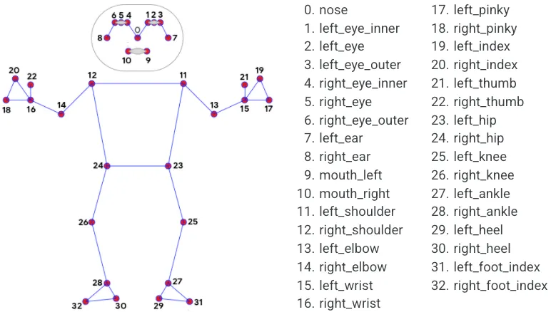
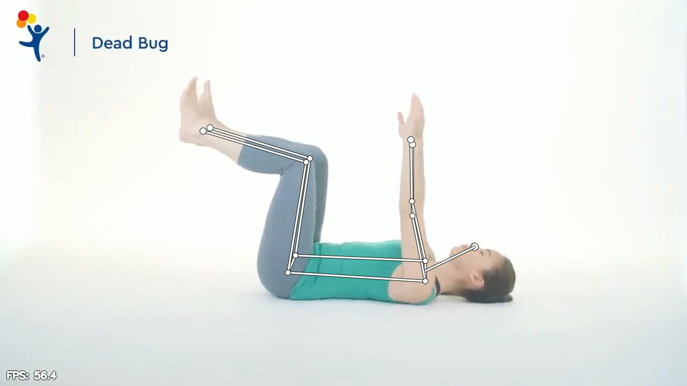
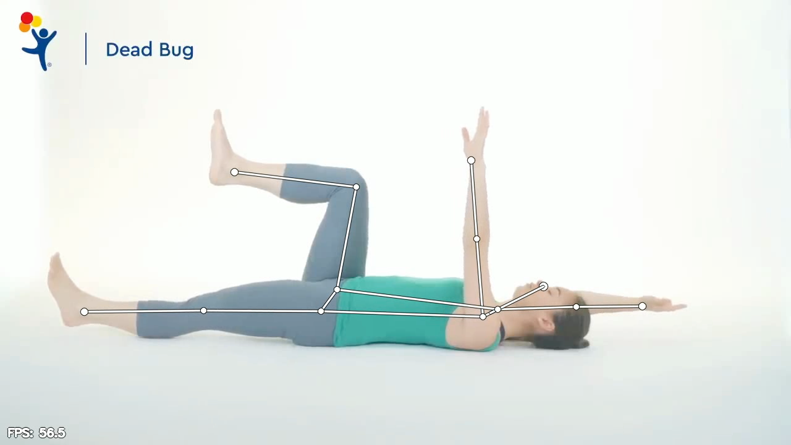
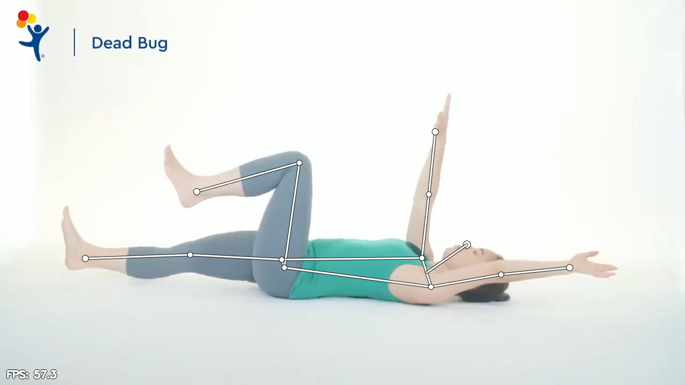

# Ідея
Тут описаний іноваційний алгоритм, який я хочу реалізувати, який в подальшому набиратиме розвитку.
Алгоритм спрямований на валідацію виконання реабілітаційних вправ у реальному часі із використанням моделі
розпізнавання поз (MediaPipe Pose) та зворотнього звʼязку користувачу.
Алгоритм буде універсальним і зможе працювати з будь-якою вправою, якщо вона буде описана у відповідному форматі.
Моя ідея полягає в тому, щоб вправа являла собою 1 ідеальний цикл
виконання з довільною кількістю повторів (хоча і це також можна буде додати в конфігураційний простір алгоритму).
Від такого одного циклу і буде відштовхуватися алгоритм валідації вправи.

Отже, що являє собою цей ідеальний цикл?
Кожна опорна точка характеризується певним набором властивостей, які можна виміряти.
1. Цикл вправи повинен характеризуватися певною послідовністю етапів. Кожен етап - це багатовимірний вектор, який містить 
взаємне положення усіх опорних точок. Такий етап вважається досягнутим, якщо тіло пацієнта опинилось в ньому із допустимою похибкою.
Вправа не може вважатись завершеною, якщо не були досягнуті усі етапи у правильній послідовності. В такому випадку, фіксується
порушення виконання вправи та надається зворотній звʼязок користувачу про пропущений етап.
2. Кожна опорна точка має своє положення відносно інших точок. Саме це відносне положення включається в конфігурацію етапу
в циклі виконання вправи. Відносне положення характеризуєть кутом між двома векторами, які утворюються із трьох опорних точок.
Наприклад, у вправі "мертвий жук" важливо, щоб кут між вектором "плече-лікоть" та вектором "лікоть-запʼястя" був близьким до 180 градусів.
Якщо користувач не дотримується цього правила, це фіксується як порушення і надається зворотній звʼязок про необхідність виправлення кута.
3. Алгоритмом передбачається розрахунок швидкості переходу між одним етапом і іншим. У випадку, якщо користувач робить це надто швидко,
або навпаки надто повільно, це також фіксується як порушення і надається зворотній відгук про необхідність зміни швидкості в переході між етапами.
4. Алгоритм працює в реальному часі, надаючи користувачу миттєвий зворотній звʼязок про якість виконання вправи.
5. Алгоритм враховує позицію опорних точок у просторі, отриманих за допомогою моделі штучного інтелекту з розпізнавання поз. На даний момент використовується **MediaPipe Pose** - високоточна модель від Google, що визначає 33 опорні точки тіла людини в реальному часі.
6. Цикл вважається успішно завершеним, якщо усі етапи були досягнуті у правильній послідовності, з дотриманням усіх вимог.

Опорні точки MediaPipe:


Стаття із MediaPipe:
https://www.researchgate.net/publication/361071987_Yoga_pose_classification_a_CNN_and_MediaPipe_inspired_deep_learning_approach_for_real-world_application

---

# Математичне формулювання

## Задача реального часу валідації виконання реабілітаційних вправ

### Формулювання

**Дано:**
- Відеопотік $\mathcal{V} = \{I_1, I_2, \ldots, I_T\}$, де $I_t \in \mathbb{R}^{H \times W \times 3}$ — RGB-кадр у момент часу $t$
- Модель оцінки пози $\mathcal{M}: \mathbb{R}^{H \times W \times 3} \to \mathbb{R}^{K \times 2} \times [0, 1]^K$, яка відображає кадр у набір $K$ опорних точок (keypoints) з координатами та оцінками впевненості
- Конфігурація вправи $\mathcal{C} = (S, \Theta, T, G)$, де:
  - $S = \{s_1, s_2, \ldots, s_N\}$ — множина етапів (stages)
  - $\Theta = \{\theta_1, \theta_2, \ldots, \theta_M\}$ — множина кутових обмежень
  - $T \subseteq S \times S$ — множина допустимих переходів між етапами
  - $G$ — множина глобальних геометричних обмежень (симетрія, стабільність, колінеарність)

**Знайти:**

Функцію валідації $\mathcal{F}: \mathcal{V} \times \mathcal{C} \to \mathcal{R}$, яка для кожного кадру $I_t$ визначає:

1. **Поточний етап** $s_t \in S \cup \{\text{TRANSITION}\}$
2. **Множину порушень** $V_t \subseteq \Theta \cup G$
3. **Зворотній зв'язок** $feedback_t$ — текстові рекомендації для корекції
4. **Лічильник завершених циклів** $n_{cycles} \in \mathbb{N}_0$

### Обмеження та критерії

**1. Кутові обмеження** ($\theta_i \in \Theta$):

Для кожного обмеження $\theta_i = (p_a, p_b, p_c, \alpha_{ideal}, \delta)$ перевіряється:

$$\left| \angle(p_a, p_b, p_c) - \alpha_{ideal} \right| \leq \delta$$

де $\angle(p_a, p_b, p_c)$ — кут у точці $p_b$, утворений векторами $\vec{v_1} = p_a - p_b$ та $\vec{v_2} = p_c - p_b$.

**2. Темпоральні обмеження** (переходи між етапами):

Для кожного переходу $(s_i, s_j) \in T$ з часом утримання $\tau_{ij}$:

$$t_{min}^{ij} \leq \tau_{ij} \leq t_{max}^{ij}$$

де $t_{min}^{ij}, t_{max}^{ij}$ — мінімальний та максимальний допустимі часи переходу.

**3. Глобальні геометричні обмеження** ($g \in G$):

- **Симетрія:** $|y_i - y_j| \leq \epsilon_{sym}$ для симетричних точок $(p_i, p_j)$
- **Стабільність:** $\left| \frac{d_t - d_0}{d_0} \right| \leq \epsilon_{stab}$, де $d_t = ||p_i^t - p_j^t||$ — поточна відстань між точками, $d_0$ — базова відстань
- **Колінеарність:** $\left| \cos(\alpha_{ijk}) \right| \geq \tau_{align}$ для точок $(p_i, p_j, p_k)$, що мають бути на одній лінії

**4. Послідовність етапів:**

Цикл вважається завершеним, якщо послідовність пройдених етапів $\{s_{t_1}, s_{t_2}, \ldots, s_{t_n}\}$ відповідає заданій конфігурації циклу $\sigma \in S^*$:

$$\{s_{t_1}, s_{t_2}, \ldots, s_{t_n}\} = \sigma$$

### Цільова функція

Максимізувати якість виконання вправи:

$$Q = \frac{n_{cycles}}{n_{cycles} + w_v \cdot |V| + w_t \cdot \sum_{(i,j) \in T'} |\tau_{ij} - \tau_{ij}^{opt}|}$$

де:
- $n_{cycles}$ — кількість успішно завершених циклів
- $|V| = \sum_{t=1}^T |V_t|$ — загальна кількість порушень
- $T'$ — множина фактично здійснених переходів
- $\tau_{ij}^{opt}$ — оптимальний час переходу
- $w_v, w_t$ — вагові коефіцієнти для порушень та часу

### Обмеження реального часу

Алгоритм повинен забезпечувати:

$$t_{process}(I_t) \leq \frac{1}{fps}, \quad \forall t \in [1, T]$$

де $t_{process}(I_t)$ — час обробки кадру $I_t$, $fps$ — кількість кадрів на секунду (зазвичай $fps \geq 30$).

### Виходи алгоритму

**Результат валідації** $\mathcal{R}$:

$$\mathcal{R} = \left\{ (t, s_t, V_t, feedback_t) \mid t \in [1, T] \right\} \cup \{ n_{cycles}, Q, \text{timeline} \}$$

де:
- $(t, s_t, V_t, feedback_t)$ — часова мітка, етап, порушення та зворотній зв'язок для кадру $t$
- $n_{cycles}$ — кількість завершених циклів
- $Q$ — загальна оцінка якості виконання
- $\text{timeline}$ — візуалізація послідовності етапів у часі

---

# Приклад алгоритму
## Вправа "Мертвий жук"

### Джерело

#### Сайт клініки Children's Hospital Colorado:

https://www.childrenscolorado.org/doctors-and-departments/departments/orthopedics/programs/spine-and-back/

#### Відео інструкція

https://www.youtube.com/watch?v=g_BYB0R-4Ws

### Опис вправи
Вправа "мертвий жук" виконується лежачи на спині. Ідеальний цикл складається з наступних етапів:

**Початкова позиція (Етап 0 - REST):**
- Користувач лежить на спині
- Обидві руки підняті вертикально вгору (перпендикулярно до тулуба)
- Обидва коліна зігнуті під кутом ~90° (табличка - стегна перпендикулярні до підлоги)
- Поперек притиснутий до підлоги

**Етап 1 - LEFT_PHASE (ліва фаза):**
- Ліва нога випрямляється і опускається до підлоги (кут в лівому стегні →180°)
- Права рука опускається назад за голову (рух до підлоги)
- Права нога залишається зігнутою (~90° в коліні)
- Ліва рука залишається вертикальною

**Етап 2 - RETURN_TO_REST:**
- Повернення до початкової позиції (Етап 0)

**Етап 3 - RIGHT_PHASE (права фаза):**
- Права нога випрямляється і опускається до підлоги (кут в правому стегні →180°)
- Ліва рука опускається назад за голову
- Ліва нога залишається зігнутою
- Права рука залишається вертикальною

**Етап 4 - RETURN_TO_REST:**
- Повернення до початкової позиції (Етап 0)

**Цикл завершено**: Етап 0 → Етап 1 → Етап 0 → Етап 3 → Етап 0

---

### Конфігурація етапів

#### Етап 0: REST (початкова/відпочинкова позиція)

**Опорні точки (MediaPipe BlazePose):**
- 11: left_shoulder, 12: right_shoulder
- 13: left_elbow, 14: right_elbow
- 15: left_wrist, 16: right_wrist
- 23: left_hip, 24: right_hip
- 25: left_knee, 26: right_knee
- 27: left_ankle, 28: right_ankle

**Кутові обмеження:**
1. Лівий лікоть (плече→лікоть→зап'ястя):
   - Точки: (11, 13, 15)
   - Ідеальний кут: 170°-180° (рука випрямлена вгору)
   - Допуск: ±15°

2. Правий лікоть (плече→лікоть→зап'ястя):
   - Точки: (12, 14, 16)
   - Ідеальний кут: 170°-180°
   - Допуск: ±15°

3. Ліве коліно (стегно→коліно→щиколотка):
   - Точки: (23, 25, 27)
   - Ідеальний кут: 80°-100° (нога зігнута)
   - Допуск: ±20°

4. Праве коліно (стегно→коліно→щиколотка):
   - Точки: (24, 26, 28)
   - Ідеальний кут: 80°-100°
   - Допуск: ±20°

5. Вертикальність лівої руки (відносно тулуба):
   - Вектор руки: (13-11) - від плеча до ліктя
   - Вектор тулуба: (23-11) - від плеча до стегна
   - Ідеальний кут: 70°-110° (близько до перпендикуляра)
   - Допуск: ±20°

6. Вертикальність правої руки:
   - Вектор руки: (14-12)
   - Вектор тулуба: (24-12)
   - Ідеальний кут: 70°-110°
   - Допуск: ±20°

**Тривалість утримання етапу:** мінімум 0.3 секунди

---

#### Етап 1: LEFT_PHASE (ліва нога + права рука)

**Кутові обмеження:**
1. Ліве стегно (випрямлена нога):
   - Точки: (11, 13, 15)
   - Ідеальний кут: 160°-180°
   - Допуск: ±15°

2. Праве коліно (зігнута нога):
   - Точки: (12, 14, 16)
   - Ідеальний кут: 80°-100°
   - Допуск: ±20°

3. Лівий лікоть (вертикальна рука):
   - Точки: (5, 7, 9)
   - Ідеальний кут: 170°-180°
   - Допуск: ±15°

4. Правий лікоть (рука за головою):
   - Точки: (6, 8, 10)
   - Ідеальний кут: 160°-180° (рука випрямлена)
   - Допуск: ±20°

5. Права рука відносно горизонталі (опускання за голову):
   - Y-координата правого зап'ястя (10) < Y-координата правого плеча (6)
   - Різниця: мінімум 30 пікселів

**Координація (протилежні кінцівки):**
- Ліва нога (13→15) має рухатись вниз одночасно з правою рукою (8→10)
- Допустима асинхронність: ±0.5 секунди

**Тривалість утримання етапу:** мінімум 0.5 секунди

---

#### Етап 3: RIGHT_PHASE (права нога + ліва рука)

**Кутові обмеження:**
1. Праве стегно (випрямлена нога):
   - Точки: (12, 14, 16)
   - Ідеальний кут: 160°-180°
   - Допуск: ±15°

2. Ліве коліно (зігнута нога):
   - Точки: (11, 13, 15)
   - Ідеальний кут: 80°-100°
   - Допуск: ±20°

3. Правий лікоть (вертикальна рука):
   - Точки: (6, 8, 10)
   - Ідеальний кут: 170°-180°
   - Допуск: ±15°

4. Лівий лікоть (рука за головою):
   - Точки: (5, 7, 9)
   - Ідеальний кут: 160°-180°
   - Допуск: ±20°

5. Ліва рука відносно горизонталі:
   - Y-координата лівого зап'ястя (9) < Y-координата лівого плеча (5)
   - Різниця: мінімум 30 пікселів

**Координація:**
- Права нога має рухатись вниз одночасно з лівою рукою
- Допустима асинхронність: ±0.5 секунди

**Тривалість утримання етапу:** мінімум 0.5 секунди

---

### Правила переходів між етапами

**Дозволені переходи:**
1. REST (0) → LEFT_PHASE (1) - швидкість: 1.0-2.0 секунди
2. LEFT_PHASE (1) → REST (0) - швидкість: 1.0-2.0 секунди
3. REST (0) → RIGHT_PHASE (3) - швидкість: 1.0-2.0 секунди
4. RIGHT_PHASE (3) → REST (0) - швидкість: 1.0-2.0 секунди

**Недозволені переходи (порушення):**
- LEFT_PHASE (1) → RIGHT_PHASE (3) без повернення в REST
- Будь-який перехід швидше 0.8 секунди (надто швидко)
- Будь-який перехід повільніше 3.0 секунд (надто повільно)

---

### Загальні вимоги до виконання

**1. Стабільність тулуба:**
- Поперек повинен залишатись притиснутим до підлоги
- Перевірка: відстань між лопатками (точки 5-6) та стегнами (точки 11-12) має залишатись стабільною
- Допуск: ±10% від початкового значення

**2. Рівність плечей:**
- Ліве та праве плече мають бути на одному рівні (симетрія)
- Перевірка: |Y-координата(5) - Y-координата(6)| < 20 пікселів

**3. Рівність стегон:**
- Ліве та праве стегно мають бути на одному рівні
- Перевірка: |Y-координата(11) - Y-координата(12)| < 20 пікселів

**4. Мінімальна видимість точок:**
- Усі критичні опорні точки мають мати confidence > 0.5
- При втраті видимості - зупинка валідації з попередженням

---

# Алгоритм

## Універсальний алгоритм валідації виконання реабілітаційних вправ

### 1. Структура даних та ініціалізація

#### 1.1. Конфігурація вправи

```python
class ExerciseConfig:
    """
    Конфігурація вправи - містить всю необхідну інформацію для валідації.
    Конфігурація завантажується з JSON/YAML файлу для кожної вправи окремо.
    """
    def __init__(self, config_dict):
        self.exercise_name = config_dict['exercise_name']
        self.stages = config_dict['stages']  # Словник етапів
        self.allowed_transitions = config_dict['allowed_transitions']  # Дозволені переходи
        self.global_constraints = config_dict.get('global_constraints', [])  # Загальні обмеження
        self.cycle_sequence = config_dict['cycle_sequence']  # Послідовність етапів для циклу
        self.fps = config_dict.get('fps', 30)  # FPS відео

# Приклад структури конфігурації (загальна для всіх вправ)
config_structure = {
    'exercise_name': str,  # Назва вправи
    'stages': {
        'STAGE_NAME': {
            'id': int,  # Унікальний ідентифікатор етапу
            'angle_constraints': [  # Кутові обмеження
                {
                    'joints': tuple,  # Трійка індексів keypoints (a, b, c) для кута в точці b
                    'ideal': float,  # Ідеальний кут в градусах
                    'tolerance': float,  # Допустиме відхилення ±
                    'name': str  # Назва обмеження (для feedback)
                }
            ],
            'coordinate_checks': [  # Координатні перевірки (опціонально)
                {
                    'type': str,  # Тип перевірки ('distance', 'relative_position', 'symmetry')
                    'points': tuple,  # Індекси задіяних keypoints
                    'operator': str,  # Оператор порівняння ('<', '>', '==', 'range')
                    'threshold': float,  # Пороговe значення
                    'name': str  # Назва для feedback
                }
            ],
            'min_duration': float,  # Мінімальний час утримання етапу (секунди)
            'max_duration': float  # Максимальний час (опціонально)
        }
    },
    'allowed_transitions': {
        ('FROM_STAGE', 'TO_STAGE'): {
            'min_time': float,  # Мінімальний час переходу
            'max_time': float,  # Максимальний час переходу
            'required': bool  # Чи обов'язковий перехід для завершення циклу
        }
    },
    'global_constraints': [  # Обмеження, що діють протягом всієї вправи
        {
            'type': str,  # 'symmetry', 'stability', 'alignment'
            'points': tuple,  # Задіяні keypoints
            'threshold': float,
            'name': str
        }
    ],
    'cycle_sequence': list,  # Послідовність етапів для одного циклу ['STAGE_1', 'STAGE_2', ...]
    'fps': int  # Кадрів на секунду
}
```

#### 1.2. Стан валідатора

```python
class ExerciseValidator:
    """
    Універсальний валідатор вправ на основі конфігурації.
    """
    def __init__(self, config: ExerciseConfig):
        self.config = config

        # Поточний стан
        self.current_stage = None  # Ім'я поточного етапу
        self.stage_start_time = None  # Час входу в поточний етап (frame_idx)
        self.stage_history = []  # Історія всіх досягнутих етапів: [(stage_name, frame_idx), ...]

        # Статистика
        self.completed_cycles = 0
        self.violations = []  # Список всіх порушень
        self.feedback_messages = []  # Повідомлення для користувача
        self.stage_durations = {}  # Тривалості кожного етапу

        # Темпоральне згладжування
        self.stage_buffer = deque(maxlen=5)  # Буфер для згладжування визначення етапу

        # Кеш розрахунків
        self.angle_cache = {}
```

---

### 2. Основний цикл обробки кадрів

```python
def process_exercise_video(validator: ExerciseValidator, pose_model, video_path, output_path):
    """
    Універсальна функція обробки відео для будь-якої вправи.

    Args:
        validator: Екземпляр ExerciseValidator з конфігурацією вправи
        pose_model: Модель pose estimation (RTMPose/MediaPipe/YOLO)
        video_path: Шлях до вхідного відео
        output_path: Шлях для збереження результату
    """
    cap = cv2.VideoCapture(video_path)
    fps = validator.config.fps

    # Ініціалізація output writer
    frame_width = int(cap.get(cv2.CAP_PROP_FRAME_WIDTH))
    frame_height = int(cap.get(cv2.CAP_PROP_FRAME_HEIGHT))
    fourcc = cv2.VideoWriter_fourcc(*'mp4v')
    out = cv2.VideoWriter(output_path, fourcc, fps, (frame_width, frame_height))

    frame_idx = 0

    while cap.isOpened():
        ret, frame = cap.read()
        if not ret:
            break

        # Крок 1: Отримати keypoints з моделі
        keypoints, confidences = pose_model.detect(frame)

        # Крок 2: Перевірка видимості критичних точок
        if not validator.check_visibility(keypoints, confidences):
            validator.add_feedback(frame_idx, 'WARNING',
                                  'Втрата видимості опорних точок. Переконайтесь, що все тіло в кадрі.')
            frame_idx += 1
            continue

        # Крок 3: Визначити поточний етап на основі конфігурації
        detected_stage = validator.detect_stage(keypoints)

        # Крок 4: Валідація переходу між етапами
        if detected_stage != validator.current_stage:
            transition_result = validator.validate_transition(detected_stage, frame_idx)

            if not transition_result['valid']:
                validator.add_violation(frame_idx, 'INVALID_TRANSITION', transition_result)
                validator.add_feedback(frame_idx, 'ERROR', transition_result['message'])
            else:
                # Валідний перехід - оновлюємо стан
                validator.update_stage(detected_stage, frame_idx)

                # Перевірка завершення циклу
                if validator.check_cycle_completion():
                    validator.completed_cycles += 1
                    validator.add_feedback(frame_idx, 'SUCCESS',
                                         f'Цикл {validator.completed_cycles} завершено успішно!')

        # Крок 5: Валідація поточного етапу (кути, координати)
        stage_violations = validator.validate_current_stage(keypoints)

        for violation in stage_violations:
            validator.add_violation(frame_idx, 'STAGE_CONSTRAINT', violation)
            validator.add_feedback(frame_idx, 'CORRECTION', violation['feedback'])

        # Крок 6: Перевірка загальних вимог (стабільність, симетрія)
        global_violations = validator.validate_global_constraints(keypoints)

        for violation in global_violations:
            validator.add_violation(frame_idx, 'GLOBAL_CONSTRAINT', violation)
            validator.add_feedback(frame_idx, 'WARNING', violation['feedback'])

        # Крок 7: Візуалізація
        annotated_frame = validator.visualize_frame(frame, keypoints, frame_idx)

        # Запис у вихідне відео
        out.write(annotated_frame)
        frame_idx += 1

    # Завершення
    cap.release()
    out.release()

    # Генерація звіту
    report = validator.generate_report()
    return report
```

---

### 3. Допоміжні функції

#### 3.1. Визначення поточного етапу

```python
def detect_stage(keypoints, stages_config):
    """
    Визначає поточний етап на основі кутових обмежень та координатних перевірок.
    Повертає назву етапу, який найкраще відповідає поточній позі.
    """
    stage_scores = {}

    for stage_name, stage_data in stages_config.items():
        score = 0
        total_constraints = 0

        # Перевірка кутів
        for constraint in stage_data['angle_constraints']:
            joints = constraint['joints']
            ideal_angle = constraint['ideal']
            tolerance = constraint['tolerance']

            # Розрахувати кут між трьома точками
            angle = calculate_angle(
                keypoints[joints[0]],
                keypoints[joints[1]],
                keypoints[joints[2]]
            )

            # Перевірка відповідності
            if abs(angle - ideal_angle) <= tolerance:
                score += 1

            total_constraints += 1

        # Перевірка координатних умов (якщо є)
        if 'coordinate_checks' in stage_data:
            for check in stage_data['coordinate_checks']:
                if check['check'] == 'wrist_below_shoulder':
                    pt1, pt2 = check['points']
                    if keypoints[pt1][1] < keypoints[pt2][1] - check['min_diff']:
                        score += 1
                    total_constraints += 1

        # Нормалізований score для етапу
        stage_scores[stage_name] = score / total_constraints if total_constraints > 0 else 0

    # Вибрати етап з найвищим score (але > 0.7 для впевненості)
    best_stage = max(stage_scores, key=stage_scores.get)
    if stage_scores[best_stage] > 0.7:
        return best_stage
    else:
        return 'TRANSITION'  # Проміжний стан
```

#### 3.2. Валідація переходу

```python
def validate_transition(from_stage, to_stage, stage_start_time, current_frame_idx, allowed_transitions):
    """
    Перевіряє, чи перехід між етапами дозволений і виконаний з правильною швидкістю.
    """
    transition_key = (from_stage, to_stage)

    # Перехід не дозволений
    if transition_key not in allowed_transitions:
        return False, None

    # Розрахувати час переходу
    min_time, max_time = allowed_transitions[transition_key]
    time_elapsed = (current_frame_idx - stage_start_time) / FPS  # секунди

    # Перевірка швидкості
    if time_elapsed < min_time:
        return False, time_elapsed  # Надто швидко
    if time_elapsed > max_time:
        return False, time_elapsed  # Надто повільно

    return True, time_elapsed
```

#### 3.3. Валідація поточного етапу

```python
def validate_current_stage(keypoints, stage_config):
    """
    Перевіряє, чи виконуються всі вимоги поточного етапу.
    Повертає список порушень з конкретними повідомленнями для користувача.
    """
    violations = []

    for constraint in stage_config['angle_constraints']:
        joints = constraint['joints']
        ideal = constraint['ideal']
        tolerance = constraint['tolerance']
        name = constraint['name']

        angle = calculate_angle(
            keypoints[joints[0]],
            keypoints[joints[1]],
            keypoints[joints[2]]
        )

        deviation = angle - ideal

        if abs(deviation) > tolerance:
            # Визначити напрямок корекції
            if deviation > 0:
                direction = "зменшити"
            else:
                direction = "збільшити"

            violations.append({
                'constraint': name,
                'actual_angle': angle,
                'ideal_angle': ideal,
                'deviation': deviation,
                'feedback': f"Кут {name}: {direction} на {abs(deviation):.1f}°"
            })

    return violations
```

#### 3.4. Валідація глобальних обмежень

**Математичні формули для різних типів обмежень:**

**1. Symmetry (Симетрія):**

Для двох точок $p_i, p_j$ перевіряємо різницю Y-координат:

$$\Delta y = |y_i - y_j|$$

Порушення, якщо: $\Delta y > \tau_{symmetry}$, де $\tau_{symmetry}$ - поріг симетрії.

**2. Stability (Стабільність):**

Евклідова відстань між точками $p_i, p_j$:

$$d_{current} = ||\vec{p_i} - \vec{p_j}|| = \sqrt{(x_i - x_j)^2 + (y_i - y_j)^2}$$

Відносне відхилення від базової відстані:

$$\delta = \frac{|d_{current} - d_{baseline}|}{d_{baseline}}$$

Порушення, якщо: $\delta > \tau_{stability}$ (наприклад, $\tau_{stability} = 0.1$ для ±10%).

**3. Alignment (Вирівнювання/колінеарність):**

Для трьох точок $p_1, p_2, p_3$ перевіряємо колінеарність через косинус кута між векторами:

$$\vec{v_1} = p_2 - p_1, \quad \vec{v_2} = p_3 - p_1$$

$$\cos(\alpha) = \frac{\vec{v_1} \cdot \vec{v_2}}{||\vec{v_1}|| \cdot ||\vec{v_2}||}$$

$$score_{alignment} = |\cos(\alpha)|$$

Порушення, якщо: $score_{alignment} < \tau_{alignment}$ (де $\tau_{alignment} \approx 0.95$ для майже прямої лінії).

**Імплементація:**

```python
def validate_global_constraints(keypoints, global_constraints_config):
    """
    Універсальна функція перевірки глобальних обмежень на основі конфігурації.

    Args:
        keypoints: Масив координат keypoints
        global_constraints_config: Список глобальних обмежень з конфігурації

    Returns:
        Список порушень
    """
    violations = []

    for constraint in global_constraints_config:
        constraint_type = constraint['type']
        points = constraint['points']
        threshold = constraint['threshold']
        name = constraint['name']

        if constraint_type == 'symmetry':
            # Перевірка симетрії між двома точками (Y-координати)
            pt1, pt2 = points
            diff = abs(keypoints[pt1][1] - keypoints[pt2][1])

            if diff > threshold:
                violations.append({
                    'type': 'SYMMETRY_VIOLATION',
                    'constraint': name,
                    'difference': diff,
                    'threshold': threshold,
                    'feedback': f'{name}: асиметрія {diff:.1f}px (допустимо {threshold:.1f}px). Вирівняйте положення.'
                })

        elif constraint_type == 'stability':
            # Перевірка стабільності відстані між точками
            pt1, pt2 = points
            current_distance = np.linalg.norm(keypoints[pt1] - keypoints[pt2])

            # Порівняння з базовою відстанню (зберігається в конфігурації або обчислюється в початковому кадрі)
            if 'baseline_distance' in constraint:
                baseline = constraint['baseline_distance']
                deviation = abs(current_distance - baseline) / baseline

                if deviation > threshold:
                    violations.append({
                        'type': 'STABILITY_VIOLATION',
                        'constraint': name,
                        'deviation': deviation,
                        'feedback': f'{name}: нестабільність {deviation*100:.1f}% (допустимо {threshold*100:.1f}%). Утримуйте позицію.'
                    })

        elif constraint_type == 'alignment':
            # Перевірка вирівнювання (колінеарності) точок
            pt1, pt2, pt3 = points

            # Обчислити відхилення від прямої лінії
            vec1 = keypoints[pt2] - keypoints[pt1]
            vec2 = keypoints[pt3] - keypoints[pt1]

            # Косинус кута між векторами (близько до 1 або -1 означає колінеарність)
            cos_angle = np.dot(vec1, vec2) / (np.linalg.norm(vec1) * np.linalg.norm(vec2) + 1e-6)
            alignment_score = abs(cos_angle)

            if alignment_score < threshold:  # threshold близький до 1.0
                violations.append({
                    'type': 'ALIGNMENT_VIOLATION',
                    'constraint': name,
                    'alignment_score': alignment_score,
                    'feedback': f'{name}: недостатнє вирівнювання. Зберігайте пряму лінію.'
                })

    return violations
```

#### 3.5. Перевірка завершення циклу

```python
def check_cycle_completion(stage_history, cycle_sequence):
    """
    Універсальна перевірка завершення циклу на основі конфігурації.

    Args:
        stage_history: Історія пройдених етапів [(stage_name, frame_idx), ...]
        cycle_sequence: Послідовність етапів з конфігурації ['STAGE_1', 'STAGE_2', ...]

    Returns:
        bool: True, якщо цикл завершено
    """
    if len(stage_history) < len(cycle_sequence):
        return False

    # Отримати останні N етапів (де N = довжина циклу)
    recent_stages = [stage_name for stage_name, _ in stage_history[-len(cycle_sequence):]]

    # Перевірити відповідність послідовності
    return recent_stages == cycle_sequence
```

#### 3.6. Розрахунок кута

**Математична формула:**

Для трьох опорних точок $p_1, p_2, p_3$ обчислюємо кут у точці $p_2$:

1. **Вектори:**
   $$\vec{v_1} = p_1 - p_2, \quad \vec{v_2} = p_3 - p_2$$

2. **Нормалізація:**
   $$\hat{v_1} = \frac{\vec{v_1}}{||\vec{v_1}||}, \quad \hat{v_2} = \frac{\vec{v_2}}{||\vec{v_2}||}$$

3. **Косинус кута:**
   $$\cos(\theta) = \hat{v_1} \cdot \hat{v_2} = \frac{\vec{v_1} \cdot \vec{v_2}}{||\vec{v_1}|| \cdot ||\vec{v_2}||}$$

4. **Кут у градусах:**
   $$\theta = \arccos(\cos(\theta)) \cdot \frac{180°}{\pi}$$

**Імплементація:**

```python
def calculate_angle(point1, point2, point3):
    """
    Розраховує кут в point2, утворений векторами point1→point2 та point2→point3.
    Повертає кут у градусах (0-180).
    """
    vector1 = np.array(point1) - np.array(point2)
    vector2 = np.array(point3) - np.array(point2)

    # Нормалізація векторів
    norm1 = np.linalg.norm(vector1)
    norm2 = np.linalg.norm(vector2)

    if norm1 == 0 or norm2 == 0:
        return 0

    vector1_normalized = vector1 / norm1
    vector2_normalized = vector2 / norm2

    # Косинус кута
    cos_angle = np.clip(np.dot(vector1_normalized, vector2_normalized), -1.0, 1.0)

    # Кут у градусах
    angle_rad = np.arccos(cos_angle)
    angle_deg = np.degrees(angle_rad)

    return angle_deg
```

---

### 4. Формат вихідних даних

Після обробки відео алгоритм генерує:

**4.1. JSON-звіт з метриками:**
```json
{
  "exercise": "dead_bug",
  "total_frames": 1500,
  "fps": 30,
  "completed_cycles": 8,
  "total_violations": 12,
  "violations_by_type": {
    "ANGLE_DEVIATION": 7,
    "INVALID_TRANSITION": 2,
    "SHOULDER_ASYMMETRY": 2,
    "HIP_ASYMMETRY": 1
  },
  "average_cycle_time": 15.3,
  "stage_durations": {
    "REST": {"mean": 1.2, "std": 0.3},
    "LEFT_PHASE": {"mean": 2.1, "std": 0.4},
    "RIGHT_PHASE": {"mean": 2.0, "std": 0.5}
  },
  "quality_score": 85.2
}
```

**4.2. Анотоване відео** з візуалізацією:
- Скелет з keypoints
- Поточний етап (текст на екрані)
- Feedback-повідомлення (останні 3)
- Лічильник циклів
- Quality score в реальному часі

**4.3. Timeline-діаграма** (PNG/SVG):
- Вісь часу з позначеними етапами
- Відмічені порушення червоними маркерами
- Інтервали успішних переходів зеленим кольором

---

### 5. Оптимізації для реального часу

**5.1. Темпоральне згладжування:**
```python
# Використання ковзного вікна для стабілізації визначення етапу
from collections import deque

stage_history = deque(maxlen=5)  # останні 5 кадрів

def get_smoothed_stage(detected_stage):
    stage_history.append(detected_stage)
    # Визначити найчастіший етап у вікні
    from collections import Counter
    return Counter(stage_history).most_common(1)[0][0]
```

**5.2. Кешування розрахунків:**
```python
# Кешувати кути для уникнення повторних обчислень
angle_cache = {}

def get_cached_angle(p1, p2, p3):
    key = (tuple(p1), tuple(p2), tuple(p3))
    if key not in angle_cache:
        angle_cache[key] = calculate_angle(p1, p2, p3)
    return angle_cache[key]
```

**5.3. Адаптивні пороги:**
```python
# Адаптація порогів на основі індивідуальних особливостей користувача
def calibrate_thresholds(initial_frames):
    """
    Аналізує перші N кадрів для калібрування порогів під конкретного користувача.
    """
    # Наприклад, якщо у користувача обмежена гнучкість - збільшити tolerance
    pass
```

---

### 6. На майбутнє

**6.1. Персоналізовані рекомендації:**
- На основі історії порушень генерувати індивідуальні поради
- Адаптивна складність (рівні: початковий, середній, експертний)

**6.2. Мультимодальність:**
- Голосові інструкції в реальному часі

---

## Підсумок

Алгоритм реалізує мультиетапну валідацію з жорсткими обмеженнями на кути, переходи та загальну якість виконання.
Він працює в реальному часі, надаючи миттєвий зворотній зв'язок користувачу, що робить його ідеальним для реабілітаційних застосунків.

**Ключові переваги:**
- Точна валідація на основі анатомічних кутів
- Підтримка послідовності етапів
- Контроль швидкості переходів
- Інтерпретовані feedback-повідомлення
- Розширюваність на інші вправи (просто змінити конфігурацію `stages`) без потреби застосування глибинного навчання для кожної окремої вправи.
- Якщо порівнювати із нашим Fitness Trainer: IoT solution - то там ідеєю було зберігати кожну окрему навчену нейронку для кожної окремої вправи, що не є гнучким.
